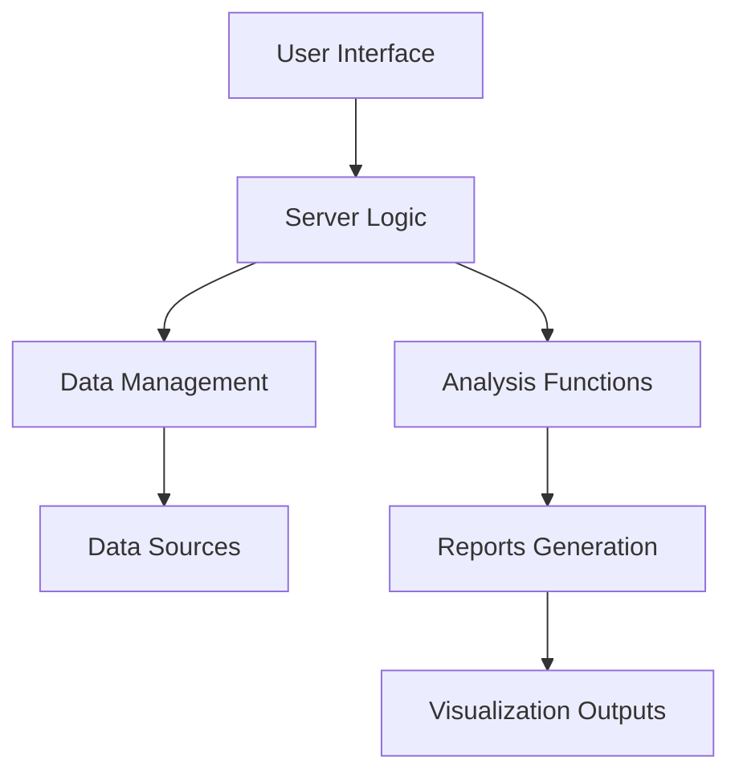
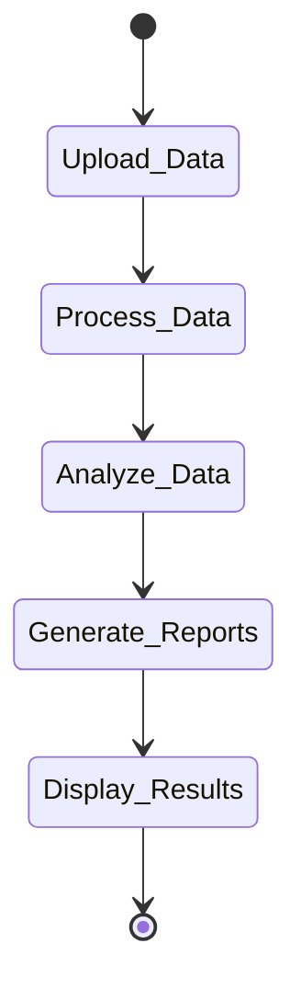
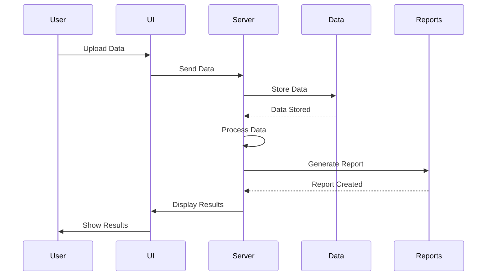
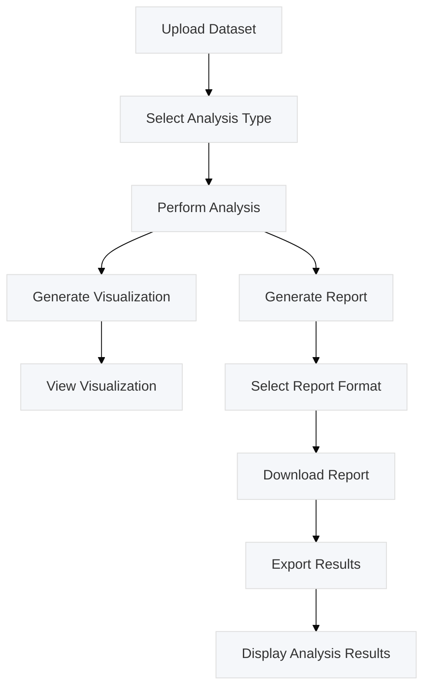

### Architecture

```mermaid
graph TD
    A[User Interface] --> B[Server Logic]
    B --> C[Data Management]
    C --> D[Data Sources]
    B --> E[Analysis Functions]
    E --> F[Reports Generation]
    F --> G[Visualization Outputs]
```
### StateDiagram

```mermaid
stateDiagram-v2
    [*] --> Upload_Data
    Upload_Data --> Process_Data
    Process_Data --> Analyze_Data
    Analyze_Data --> Generate_Reports
    Generate_Reports --> Display_Results
    Display_Results --> [*]
```
### Sequence

```mermaid
sequenceDiagram
    participant User
    participant UI
    participant Server
    participant Data
    participant Reports
    User ->> UI: Upload Data
    UI ->> Server: Send Data
    Server ->> Data: Store Data
    Data -->> Server: Data Stored
    Server ->> Server: Process Data
    Server ->> Reports: Generate Report
    Reports -->> Server: Report Created
    Server ->> UI: Display Results
    UI ->> User: Show Results
```
### Usecase

```mermaid
%%{init: {'theme': 'base', 'themeVariables': {'primaryColor': '#f5f7fa', 'secondaryColor': '#4f7cac', 'tertiaryColor': '#f4d35e', 'fontFamily': 'Arial'}}}%%
graph TB
    %% Define Nodes (Use Cases and Actions)
    A["Upload Dataset"]
    B["Select Analysis Type"]
    C["Perform Analysis"]
    D["Generate Visualization"]
    E["Generate Report"]
    F["View Visualization"]
    G["Download Report"]
    H["Display Analysis Results"]
    I["Select Report Format"]
    J["Export Results"]

    %% Define Flow
    A --> B
    B --> C
    C --> D
    D --> F
    C --> E
    E --> I
    I --> G
    G --> J
    J --> H


```
